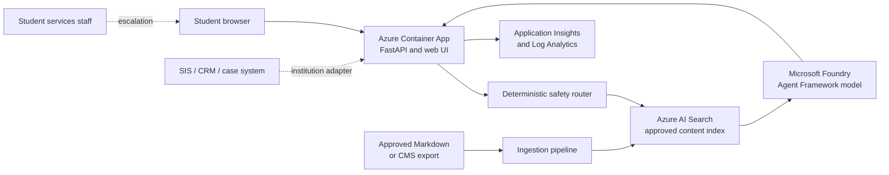

# Student Services Assistant Accelerator

A reference implementation for building a grounded, FERPA-aware student services assistant with Microsoft Foundry, Azure AI Search, Azure Container Apps, and Azure Monitor.

The accelerator answers common questions from institution-approved content, cites its sources, routes sensitive or account-specific requests to staff, and runs locally without an Azure subscription. It is a starting point for customer workshops and proofs of concept, not a production student-information system.

## What Is Included

- A responsive student chat experience and FastAPI service.
- Microsoft Agent Framework integration through `FoundryChatClient`.
- Semantic retrieval from Azure AI Search, with optional hybrid vector retrieval.
- A deterministic safety router before retrieval and model invocation.
- Citations, insufficient-evidence responses, and staff escalation.
- Approved-content samples and an idempotent indexing script.
- A review-first university website importer that respects `robots.txt`.
- Application Insights telemetry without message-body logging.
- Passwordless managed identity and RBAC between Azure services.
- `azd` and Bicep infrastructure for a cost-optimized workshop deployment.
- Unit/API tests and a starter evaluation dataset.

## Architecture



The browser never calls Foundry or Search directly. The API owns routing, retrieval, prompt construction, citations, and escalation. A user-assigned managed identity gives the container app least-privilege access to ACR, Search, and Foundry.

## Local Quickstart

Prerequisites: Python 3.11 or newer.

```powershell
python -m venv .venv
.\.venv\Scripts\Activate.ps1
python -m pip install -e ".[dev]"
Copy-Item .env.example .env
uvicorn app.main:app --app-dir src/api --reload
```

Open `http://127.0.0.1:8000`. Mock mode uses files in `data/knowledge`, makes no Azure calls, and is the recommended workshop starting point.

Run the quality checks:

```powershell
python -m pytest
python -m ruff check .
python -m mypy
```

## Customize for an Institution

Run the interactive setup and provide the university's official HTTPS website when prompted:

```powershell
python -m scripts.customize
```

For example, create a bounded James Madison University review bundle:

```powershell
python -m scripts.customize `
  --institution "James Madison University" `
  --website "https://www.jmu.edu/index.shtml" `
  --support-destination "JMU Student Success Center" `
  --max-pages 25 `
  --max-depth 2
```

The importer follows same-host HTML links, honors `robots.txt`, strips navigation and forms, and limits crawl depth and page count. It writes Markdown and a `manifest.json` with `review_status: pending` under `data/imported/<institution>`. Imported bundles are ignored by Git by default and are never indexed automatically.

Before using the content:

1. Review every generated page with the institutional content owner.
2. Remove content that is stale, duplicated, restricted, or unsuitable for student-facing answers.
3. Record approval according to the institution's content governance process.
4. Copy approved Markdown to `data/knowledge` for local mock mode, or index the reviewed directory with `python scripts/ingest.py --source <reviewed-directory>` for Azure AI Search.
5. Extend `src/api/app/safety.py` with institution-approved escalation categories and run the tests and evaluations.

The generated Markdown retains each original page URL. Local and Azure retrieval return that URL in citations. Public website content is not automatically institution-approved, and this accelerator is not affiliated with JMU.

Each content file should have a clear title, one policy topic, effective dates where relevant, and an authoritative public URL. Do not ingest advising notes, case records, disability information, financial records, or other student-level data into the shared knowledge index.

## Azure Deployment

New to Azure AI development? Follow the [step-by-step Azure deployment guide](docs/azure-deployment-guide.md). It explains the Azure account and permission requirements, tool installation, Foundry model availability, deployment, content indexing, testing, monitoring, troubleshooting, and cleanup from the beginning.

The commands below are the abbreviated path for experienced Azure users.

The included deployment is intentionally cost-optimized for a workshop:

- Azure Container Apps consumption, `0.5` vCPU, `1 GiB`, scale from zero to three replicas.
- Azure Container Registry Basic.
- Azure AI Search Basic with one replica and one partition.
- Foundry chat and embedding model deployments using pay-per-token capacity.
- Thirty-day Log Analytics retention.
- Public endpoints secured with HTTPS, managed identity, and Entra ID data-plane access.

Prerequisites:

- Azure CLI and Azure Developer CLI (`azd`).
- An Azure subscription where you can create resources and role assignments.
- A region that supports the selected Foundry models and sufficient model quota.

Model and quota availability are subscription- and region-specific. Verify them before provisioning; the repository does not assume a region is available.

```powershell
az login
azd auth login
azd env new student-services-dev
azd env set AZURE_LOCATION <supported-region>
azd env set INSTITUTION_NAME "James Madison University"
azd env set UNIVERSITY_WEBSITE "https://www.jmu.edu/index.shtml"
azd env set SUPPORT_DESTINATION "JMU Student Success Center"
azd up
```

`azd up` provisions resources, builds the root Docker context with `src/api/Dockerfile`, pushes the image, and updates the Container App. The output includes the application endpoint.

After provisioning, ingest approved content with your signed-in identity:

```powershell
azd env get-values | ForEach-Object {
  if ($_ -match '^([^=]+)="(.*)"$') {
    [Environment]::SetEnvironmentVariable($matches[1], $matches[2], 'Process')
  }
}
python scripts/ingest.py
```

To enable hybrid vector search, set the Bicep parameter `enableVectorSearch` to `true`, redeploy, and run:

```powershell
python scripts/ingest.py --with-vectors
```

The deployer receives Search Service Contributor and Search Index Data Contributor when `AZURE_PRINCIPAL_ID` is available. The runtime identity receives only Search Index Data Reader.

Remove the workshop environment when finished:

```powershell
azd down --purge
```

Review the generated resource list before confirming teardown. Model availability and deployment names can be changed through parameters in `infra/main.bicep`.

## SIS, CRM, and Case Systems

Keep account-specific workflows behind a separate institution-owned adapter. The assistant currently refuses to claim access to records and routes requests such as "What is my balance?" or "Change my registration" to staff.

A production adapter should:

- Authenticate the student with Microsoft Entra External ID or the institution identity provider.
- Request explicit consent before reading a student record.
- Use narrowly scoped APIs for a single task, never broad database access.
- Return a typed result that distinguishes success, not found, forbidden, and staff review.
- Apply authorization in the source system; never rely on the model for access control.
- Keep record data out of prompts and logs unless a reviewed use case requires it.
- Require confirmation for state-changing actions and retain an auditable receipt.

Add these operations as explicit API tools after institutional security, privacy, registrar, and financial-aid review. Do not add SIS tables to the general Search index.

## FERPA and Privacy Baseline

This accelerator reduces risk but does not itself establish FERPA compliance. The institution remains responsible for policy, legal review, records classification, consent, contracts, and operational controls.

- Ground responses only in approved, non-student-specific content.
- Do not use chat history to train models by default.
- Do not log prompts, responses, student IDs, or record payloads.
- Minimize telemetry to route, latency, outcome, citation count, and error category.
- Publish retention and acceptable-use notices before collecting conversations.
- Use staff escalation for eligibility, aid, admissions, conduct, emergency, and record decisions.
- Test prompt injection, unsupported claims, data disclosure, and cross-student access.

For production, replace public endpoints with private endpoints and VNet integration, use a web application firewall where internet ingress is required, configure Entra authentication, add content lifecycle approvals, and send security logs to the institution SIEM. Add Key Vault only when connectors introduce real secrets; managed identity is used everywhere in the reference path.

## Content Operations

Treat content as a governed product:

1. Assign an owner and reviewer to each domain.
2. Export only published content from the authoritative CMS or policy repository.
3. Scan, normalize, chunk, and tag it with source, audience, effective date, and expiry date.
4. Build a candidate Search index and run retrieval/evaluation tests.
5. Obtain owner approval, then swap the active index alias or configuration.
6. Monitor unanswered questions and stale citations without retaining student text.

The sample ingester creates a compact index for workshops. Production ingestion should preserve source metadata, remove expired documents, use index aliases for rollback, and use an event-driven pipeline rather than running from a workstation.

## Evaluation

`evals/student-services.jsonl` contains starter cases for grounding, escalation, sensitive-data handling, and prompt injection. Expand it with institution-authored questions and expected source IDs.

For every release, measure:

- Retrieval relevance and citation correctness.
- Groundedness and unsupported-claim rate.
- Correct escalation and refusal behavior.
- Helpfulness for ambiguous, multilingual, and accessibility-oriented phrasing.
- Latency, error rate, and no-answer rate.

Human reviewers from each student-services domain should approve the release. Automated scores are a gate, not the final authority.

## Production Cost Levers

The main cost drivers are model tokens, Search tier/replicas, Container Apps minimum replicas, and telemetry volume. Start with semantic text retrieval, scale-to-zero compute, short answers, small retrieval sets, and sampling for non-error traces. Enable vectors only after evaluation demonstrates a relevance benefit. Production reliability may require multiple Search replicas, a nonzero app minimum, zone redundancy, private networking, and longer security-log retention.

## Repository Layout

```text
data/knowledge/        Approved workshop content
data/imported/         Ignored, pending website review bundles
docs/                  Beginner deployment and implementation guides
evals/                 Evaluation cases and guidance
infra/                 Bicep deployment
scripts/customize.py   University website onboarding utility
scripts/ingest.py      Search indexing utility
scripts/website_source.py  Bounded website crawler
src/api/app/           FastAPI, agent, retrieval, safety, and UI
tests/                 Safety, service, and API tests
azure.yaml             Azure Developer CLI project
```

## Responsible Extension Checklist

- Preserve deterministic routing before model invocation.
- Keep authorization and business rules outside prompts.
- Require citations for policy claims.
- Fail closed when evidence is missing.
- Add focused tests and evaluation cases with every new workflow.
- Document data flows, retention, owners, and escalation service levels.
- Complete threat modeling, accessibility testing, privacy review, and operational readiness before production use.
<!-- End of accelerator guide. -->
