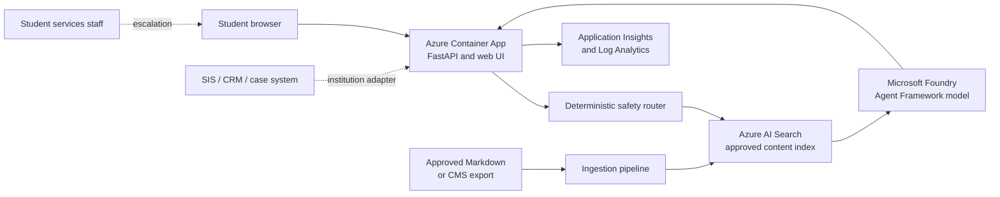

# Student Services Assistant Accelerator

A reference implementation for a grounded, FERPA-aware student services assistant built with Microsoft Foundry and Azure AI Search.

It answers questions from institution-approved content, cites its sources, and routes sensitive or account-specific requests to staff. It also runs locally without Azure, making it suitable for workshops and proofs of concept.

> [!IMPORTANT]
> This accelerator is not a production student-information system. Institutions remain responsible for security, privacy, accessibility, legal, content-governance, and operational reviews.

## Start Here

| Goal | Where to begin |
| --- | --- |
| Try the assistant locally | [Local quickstart](#1-try-it-locally) |
| Use your university website | [Customize the content](#2-customize-for-an-institution) |
| Deploy into Azure | [Azure deployment](#3-deploy-to-azure) |
| Prepare for production | [Safety and production readiness](#safety-and-production-readiness) |

## What's Included

| Area | Included |
| --- | --- |
| Experience | Responsive chat UI and FastAPI service |
| AI | Microsoft Agent Framework with Foundry models |
| Grounding | Semantic Azure AI Search, citations, and optional vectors |
| Safety | Deterministic routing before model calls and staff escalation |
| Content | Approved samples and a review-first website importer |
| Operations | Managed identity, RBAC, Application Insights, and Log Analytics |
| Deployment | Cost-conscious Bicep and Azure Developer CLI (`azd`) setup |
| Quality | Unit/API tests and starter evaluation cases |

## Architecture



The browser never calls Foundry or Search directly. The API owns routing, retrieval, prompt construction, citations, and escalation. A user-assigned managed identity gives the container app least-privilege access to ACR, Search, and Foundry.

## 1. Try It Locally

You need Python 3.11 or newer. Mock mode uses the sample files in `data/knowledge` and makes no Azure calls.

```powershell
python -m venv .venv
.\.venv\Scripts\Activate.ps1
python -m pip install -e ".[dev]"
Copy-Item .env.example .env
uvicorn app.main:app --app-dir src/api --reload
```

Open `http://127.0.0.1:8000`. Stop the server with `Ctrl+C`.

Verify the project before making changes:

```powershell
python -m pytest
python -m ruff check .
python -m mypy
```

## 2. Customize for an Institution

Run the setup wizard and enter the institution's official HTTPS website:

```powershell
python -m scripts.customize
```

The importer honors `robots.txt`, stays on the same host, and limits crawl depth and page count. It creates a **pending review bundle** under `data/imported/<institution>`; nothing is indexed automatically.

Before indexing:

1. Review every page with the institutional content owner.
2. Remove stale, duplicated, restricted, or unsuitable content.
3. Record approval through the institution's governance process.
4. Copy approved Markdown to `data/knowledge`, or index the reviewed directory in Azure.

Source URLs are preserved for citations. Public content is not automatically institution-approved, and this project is not affiliated with JMU.

> [!CAUTION]
> Never put advising notes, case records, disability information, financial records, credentials, or other student-level data in the shared knowledge index.

## 3. Deploy to Azure

For explanations, screenshots to expect, troubleshooting, monitoring, and cleanup, use the **[complete Azure deployment guide](docs/azure-deployment-guide.md)**.

### 1. Check the prerequisites

- Azure subscription with permission to create resources and role assignments
- Capacity for `gpt-4.1-mini` and `text-embedding-3-small` in one region
- Git, Python 3.11+, Docker Desktop, Azure CLI, and Azure Developer CLI

### 2. Sign in

```powershell
az login
azd auth login
```

### 3. Create the environment

Replace the example values with your subscription, supported region, and institution.

```powershell
$subscriptionId = az account show --query id --output tsv
$principalId = az ad signed-in-user show --query id --output tsv

azd env new student-services-dev `
  --subscription $subscriptionId `
  --location "<supported-region>"
azd env set AZURE_PRINCIPAL_ID $principalId
azd env set INSTITUTION_NAME "James Madison University"
azd env set UNIVERSITY_WEBSITE "https://www.jmu.edu/index.shtml"
azd env set SUPPORT_DESTINATION "JMU Student Success Center"
```

### 4. Preview the infrastructure

```powershell
az bicep build --file infra/main.bicep --stdout | Out-Null
azd provision --preview
```

Review the subscription, region, resources, and role assignments before continuing.

### 5. Deploy

Make sure Docker Desktop is running:

```powershell
azd up
```

### 6. Verify the app

```powershell
$appUrl = azd env get-value AZURE_CONTAINER_APP_ENDPOINT
Invoke-RestMethod "$appUrl/api/health"
Start-Process $appUrl
```

The health response should report `status: ok` and `mode: azure`.

### 7. Index approved content

Load the deployment values, then index the reviewed Markdown:

```powershell
azd env get-values | ForEach-Object {
  if ($_ -match '^([^=]+)=(.*)$') {
    [Environment]::SetEnvironmentVariable(
      $matches[1], $matches[2].Trim('"'), 'Process'
    )
  }
}
python scripts/ingest.py --source data/knowledge
```

For approved imported content, replace `data/knowledge` with its reviewed directory. To use hybrid vector search, enable the `enableVectorSearch` Bicep parameter and add `--with-vectors`.

### 8. Test and monitor

```powershell
python -m pytest
azd monitor --overview
azd monitor --logs
```

Test cited answers, unsupported questions, and account-specific requests before sharing the app. When the workshop is over, follow the guide's [cleanup instructions](docs/azure-deployment-guide.md#16-remove-the-workshop-resources) to stop charges.

## Safety and Production Readiness

The reference deployment is intentionally a workshop baseline. It uses approved public content, managed identity, minimal telemetry, deterministic safety routing, and staff escalation.

| Area | Before production |
| --- | --- |
| Student records | Put SIS/CRM actions behind an institution-owned, authenticated adapter; never add record tables to Search |
| Authorization | Enforce access in the source system, not in prompts or model output |
| Privacy | Define consent, retention, acceptable use, and logging policy; do not log message bodies by default |
| Content | Assign owners, effective dates, approval, expiry, and rollback for every source |
| Network | Evaluate private endpoints, VNet integration, WAF, Entra authentication, and SIEM integration |
| Reliability | Review replicas, minimum app capacity, zones, backup, recovery, and support ownership |
| Accessibility | Complete institutional accessibility and user testing |

### Release checks

- Test retrieval relevance, citation correctness, groundedness, and no-answer behavior.
- Test escalation, prompt injection, unsupported claims, and cross-student data access.
- Add institution-authored cases to `evals/student-services.jsonl`.
- Require human approval from each student-services domain.

Primary cost drivers are model tokens, Search capacity, Container Apps replicas, and telemetry. Start small, and enable vectors or additional capacity only when evaluation or reliability requirements justify them.

## Repository Layout

```text
data/knowledge/        Approved workshop content
data/imported/         Ignored, pending website review bundles
docs/                  Beginner deployment and implementation guides
evals/                 Evaluation cases and guidance
infra/                 Bicep deployment
scripts/customize.py   University website onboarding utility
scripts/ingest.py      Search indexing utility
scripts/website_source.py  Bounded website crawler
src/api/app/           FastAPI, agent, retrieval, safety, and UI
tests/                 Safety, service, and API tests
azure.yaml             Azure Developer CLI project
```
